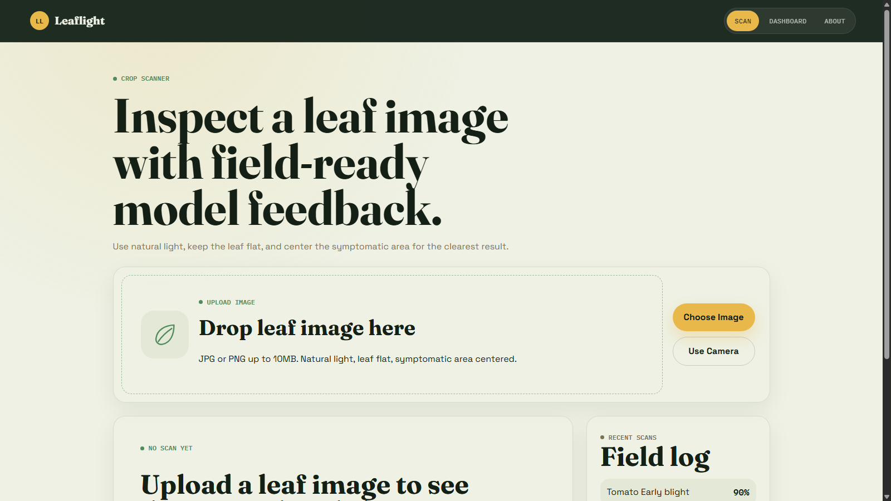
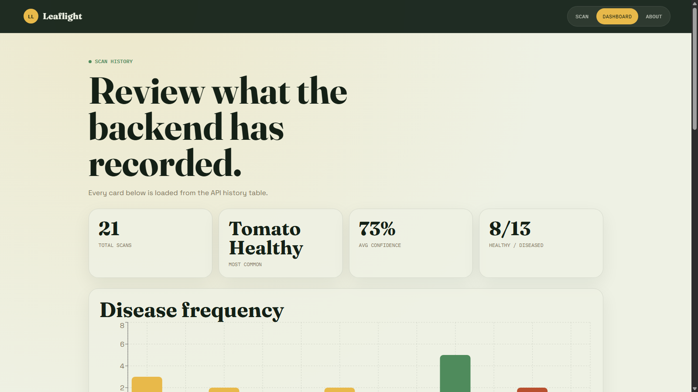

# Leaflight — Crop Disease Detection

Leaflight is a full-stack crop disease detection platform for analyzing plant leaf images. It combines a React dashboard, a FastAPI inference API, SQLite-backed disease guidance and scan history, and a reproducible PyTorch training pipeline with ONNX export.

> [!IMPORTANT]
> The application actively serves the parity-verified EfficientNetV2-S `v1` release at `models/releases/efficientnetv2_s_v1/`. The 80.7 MB ONNX binary is intentionally excluded from Git; the small release manifest, metadata, metrics, and checksums are tracked. Run `python scripts/download_model.py` to obtain or verify the exact binary. If the release is missing or invalid, `/health` returns HTTP 503 with `model_loaded: false`, and prediction endpoints fail closed.

## Latest Features

### Leaflight web app

- Drag-and-drop, file-picker, and rear-camera image capture for JPG, PNG, and WebP files up to 10 MB.
- Leaf preview with analysis/loading states and periodic backend availability checks.
- Top diagnosis, confidence score, low-confidence retake guidance, and expandable top-3 alternatives.
- Crop, severity, symptoms, and recommended-treatment guidance from SQLite.
- Helpful/not-helpful feedback logging.
- Recent scan field log plus a dashboard with total scans, most-common diagnosis, average confidence, healthy/diseased ratio, disease-frequency chart, and timestamped history cards.
- Responsive Scan, Dashboard, and About views.

### FastAPI backend

- Single-image and batch prediction endpoints backed by ONNX Runtime.
- Strict server-side image validation, configurable upload limit, and SHA-256 image hashes.
- Health, supported-class, disease-information, scan-history, and feedback endpoints.
- Automatic SQLite schema/data seeding at startup.
- CORS configuration and rotating request logs.
- Interactive OpenAPI documentation at `http://127.0.0.1:8000/docs`.

### Training and data pipeline

- Registered multi-source loading for required PlantVillage data plus optional PlantDoc and human-validated field-survey data.
- Deterministic, persisted train/validation/test manifests with content-hash grouping to reduce duplicate leakage.
- A hard training gate that accepts field-survey records only when a reviewer marks `eligible_for_training=true`.
- Field-survey ingestion from Excel/CSV/TSV, image validation, label normalization, duplicate reporting, a local human-review UI, and an append-only decision audit trail.
- Resumable EfficientNetV2-S, ConvNeXt-Tiny, and ConvNeXt-Base training with AdamW, cosine warmup, effective-number class weighting, label smoothing, MixUp/CutMix, gradient accumulation/clipping, mixed precision, EMA, and macro-F1 early stopping.
- Backbone-native timm preprocessing plus field-oriented Albumentations for illumination, color, geometry, blur, shadow/fog, JPEG degradation, and partial occlusion.
- Full evaluation, temperature scaling, ECE/reliability diagrams, atomic checkpoints, parity-checked ONNX export, CPU/GPU latency measurement, and reproducible model comparison.
- Production selection weighted by 40% validation macro F1, 20% calibration quality, 15% ONNX CPU speed, 15% ONNX size, and 10% peak GPU memory.

## Architecture

```text
PlantVillage ───────────────┐
PlantDoc (optional) ────────┼─> dataset registry ─> persisted 70/15/15 split manifest
Field survey (validated) ───┘                              │
                                                          v
                      EfficientNetV2-S / ConvNeXt-Tiny / ConvNeXt-Base
                                                          │
                                                          v
                         metrics + ONNX parity/CPU benchmark + model selection
                                                          │
                                                          v
React + Vite <── HTTP ──> FastAPI + ONNX Runtime <──> SQLite disease data/history
```

## Current Repository Status

- Persisted split: 20,638 PlantVillage images across 15 pepper, potato, and tomato classes.
- Split counts: 14,447 train, 3,097 validation, and 3,094 test images (seed 42).
- PlantDoc and field-survey sources are optional and were skipped in the current split manifest.
- The completed Phase 2.5 EfficientNetV2-S run uses the same persisted split and is deployed as application release `v1`. Other candidate training remains separate and is not required to serve this release.
- See `docs/model_comparison.md`, `docs/training_results.md`, `docs/production_model.md`, and `docs/training_pipeline_audit.md` for measured status and engineering decisions without estimated metrics.

## Active Model Release

| Field | Value |
|---|---|
| Architecture | EfficientNetV2-S (`efficientnetv2_s`) |
| Release version | `v1` |
| Input | 300×300 RGB, NCHW float32 |
| Test accuracy | 0.998707 (99.8707%) |
| Test macro F1 | 0.998905 |
| Calibrated test ECE | 0.001292 (0.1292%) |
| ONNX CPU median latency | 29.815 ms/image |
| ONNX SHA-256 | `bd0af61cba3bcc83a59d93348e6e43a539c6b60069203d7ee9d4ee746810beaa` |
| Model path | `models/releases/efficientnetv2_s_v1/model.onnx` |
| Metadata path | `models/releases/efficientnetv2_s_v1/model.json` |

These measurements come from the persisted Phase 2.5 evaluation artifacts. Validation is still dominated by PlantVillage-style imagery; this model is decision support, not a replacement for an agricultural expert or a claim of field readiness.

## Screenshots

### Scan workspace



### Analytics dashboard



## Tech Stack

| Layer | Technologies |
|---|---|
| Frontend | React 18, Vite 5, Axios, Recharts |
| API | FastAPI, Uvicorn, Pydantic, Pillow |
| Inference | ONNX Runtime, NumPy, OpenCV |
| Training | PyTorch, torchvision, timm, Albumentations, scikit-learn |
| Data/reporting | pandas, openpyxl, SQLite, Matplotlib |
| Testing | pytest, FastAPI TestClient |

## Quick Start

Run all commands from the repository root unless a section says otherwise.

### 1. Install inference dependencies

```powershell
python -m venv .venv
.\.venv\Scripts\python.exe -m pip install -r backend/requirements.txt

npm.cmd --prefix frontend install
```

The inference environment is pinned for Python 3.11 and excludes the CUDA/PyTorch training stack. Contributors running backend tests should install `backend/requirements-dev.txt`; training work still uses the separate root `requirements.txt`. Vite requires Node.js 18 or newer.

### 2. Configure the services

The frontend defaults to `http://127.0.0.1:8000`. To override it:

```powershell
$env:VITE_API_URL="http://127.0.0.1:8000"
```

Backend configuration is read from environment variables:

| Variable | Default |
|---|---|
| `MODEL_PATH` | `models/releases/efficientnetv2_s_v1/model.onnx` |
| `MODEL_METADATA_PATH` | `models/releases/efficientnetv2_s_v1/model.json` |
| `MODEL_RELEASE_MANIFEST` | `models/releases/efficientnetv2_s_v1/release.json` |
| `LEAFLIGHT_MODEL_URL` | optional override for the release manifest URL |
| `DB_PATH` | `backend/db/disease_info.db` |
| `CORS_ORIGINS` | `http://localhost:5173,http://127.0.0.1:5173` |
| `MAX_UPLOAD_SIZE_MB` | `10` |

The included `.env.example` files are references; export the variables in your shell because the application does not auto-load `.env` files.

### 3. Download and verify the model release

The active manifest points to the immutable GitHub Release asset at `model-efficientnetv2-s-v1`. Download it with the checksum-gated setup command:

```powershell
.\.venv\Scripts\python.exe scripts/download_model.py

# Optional mirror or one-time URL override
$env:LEAFLIGHT_MODEL_URL="<alternate-versioned-model-url>"
.\.venv\Scripts\python.exe scripts/download_model.py --url "<alternate-versioned-model-url>"

# Verify an existing bundle without network access
.\.venv\Scripts\python.exe scripts/download_model.py --verify-only
```

The expected ONNX SHA-256 is `bd0af61cba3bcc83a59d93348e6e43a539c6b60069203d7ee9d4ee746810beaa`. A valid existing file is reused. Downloads use timeouts, a manifest size limit, streaming SHA-256, temporary storage, and an atomic final move.

### 4. Run the backend

```powershell
.\.venv\Scripts\python.exe -m uvicorn backend.main:app `
  --reload --host 127.0.0.1 --port 8000
```

Database setup and disease-data seeding happen automatically at startup.

- Health: `http://127.0.0.1:8000/health`
- API docs: `http://127.0.0.1:8000/docs`

### 5. Run the frontend

In a second terminal:

```powershell
npm.cmd --prefix frontend run dev -- --host 127.0.0.1 --port 5173
```

Open `http://127.0.0.1:5173`.

## Docker deployment

Docker uses a verified-local-model workflow. The URL is used only before the build and is never placed in a build argument or image layer:

```powershell
python scripts/download_model.py
python scripts/download_model.py --verify-only
docker build -f backend/Dockerfile -t leaflight-api:efficientnetv2-s-v1 .
docker volume create leaflight-data
docker run --rm -p 8000:8000 -e PORT=8000 -v leaflight-data:/data leaflight-api:efficientnetv2-s-v1
```

The image verifies the release during build, runs as a non-root user, supports a platform-supplied `PORT`, has an HTTP health check, and stores SQLite at `/data/disease_info.db`. Keep `/data` mounted to persistent storage.

## API Endpoints

| Method | Endpoint | Purpose |
|---|---|---|
| `GET` | `/health` | API, model, and database status |
| `GET` | `/classes` | Classes loaded from model metadata |
| `POST` | `/predict` | Analyze one image |
| `POST` | `/predict/batch` | Analyze multiple images |
| `GET` | `/disease/{class_name}` | Disease details and guidance |
| `GET` | `/history?limit=50` | Recent scans (1–200 records) |
| `POST` | `/feedback` | Record result feedback |

## Dataset Workflow

### Download and split PlantVillage

```powershell
$env:KAGGLE_USERNAME="your_username"
$env:KAGGLE_KEY="your_key"
python -m src.data.download_data
python -m src.data.split_dataset
```

If the Kaggle CLI is unavailable, place the downloaded archive in `data/raw/` and run:

```powershell
python -m src.data.download_data --skip-download
```

### Ingest and review field-survey data

```powershell
python -m src.data.ingest_field_survey `
  --survey-file path\to\survey.xlsx `
  --image-root path\to\survey-images

python -m src.data.clean_field_survey_labels
python -m src.data.review_field_survey --host 127.0.0.1 --port 8765
```

Open `http://127.0.0.1:8765`, review the grouped labels, and accept, replace, or reject them. Original records are retained; only accepted/replaced records become training-eligible.

## Train, Benchmark, and Export

Train or resume one configured architecture:

```powershell
python -m src.training.train `
  --config configs/training/phase2_5.yaml `
  --architecture efficientnetv2_s
```

Run or resume all missing candidates and regenerate comparison reports:

```powershell
python -m src.training.benchmark --config configs/training/phase2_5.yaml --train
```

Each run writes to `artifacts/training/crop_disease_phase2_5/<architecture>/`, including:

- `best.pt` and resumable `last.pt` checkpoints
- `history.json`, `history.csv`, and `training_history.csv`
- `metrics.json`, `classification_report.json`, and `classification_report.txt`
- `confusion_matrix.png`, `calibration.json`, and `reliability_diagram.png`
- `model.onnx` and `model.json` with ONNX parity/CPU benchmark metadata

Future comparative benchmark runs remain opt-in training work. They do not alter the active `efficientnetv2_s_v1` application release unless a new parity-verified release bundle is explicitly deployed.

Swin-Tiny is supported as an optional candidate after the required three-model benchmark:

```powershell
python -m src.training.benchmark --config configs/training/phase2_5.yaml --train --include-optional
```

See `docs/future_model_roadmap.md` for the intentionally unimplemented dataset, segmentation, severity, explainability, recommendation, active-learning, and continual-learning roadmap.

## Tests

```powershell
.\.venv\Scripts\python.exe -m pip install -r backend/requirements-dev.txt
.\.venv\Scripts\python.exe -m pytest tests -q
.\.venv\Scripts\python.exe -m pytest backend/tests -q
npm.cmd --prefix frontend run build
python scripts/verify_clean_clone.py
```

The clean-clone simulation uses a temporary loopback HTTP server serving the already verified local ONNX file. It is an end-to-end test of the download and real API workflow, not a test of a public remote release.

## Release troubleshooting and publishing

- Missing model: run `python scripts/download_model.py`; configure `LEAFLIGHT_MODEL_URL` or pass `--url` only when using an alternate mirror.
- Checksum mismatch: correct the published asset or selected version; never edit the ONNX bytes or bypass verification.
- Wrong version: keep `MODEL_PATH`, `MODEL_METADATA_PATH`, and `MODEL_RELEASE_MANIFEST` in the same versioned directory.
- Download failure: check network/TLS/access configuration and timeout options. Keep credentials outside Git and out of model URLs.
- Metadata mismatch: restore the tracked files for that release; never combine artifacts from different exports.

To publish a new release, create a new versioned directory, calculate exact SHA-256 hashes and sizes, commit only `model.json`, `metrics.json`, `checksum.sha256`, and `release.json`, and upload `model.onnx` to an immutable artifact URL. Then configure and verify it with:

```powershell
$env:LEAFLIGHT_MODEL_URL="<real-versioned-model-url>"
python scripts/download_model.py --release <release-name>
python scripts/download_model.py --release <release-name> --verify-only
```

See `docs/deployment.md` for the complete clean-clone, Docker, troubleshooting, and release-publishing procedure.

## Known Limitations

- PlantVillage contains many lab-condition leaf photos; field performance can be lower under variable lighting, clutter, occlusion, or mixed symptoms.
- Disease and treatment guidance is decision support, not a substitute for local agronomy advice.
- The UI displays `MODEL LIVE` only when `/health` explicitly reports `model_loaded: true`.
- Prediction endpoints intentionally fail closed when a complete ONNX bundle is unavailable.
- The reported metrics describe the held-out Phase 2.5 split and should not be generalized to unconstrained field conditions.

See `docs/deployment.md` for deployment notes.
